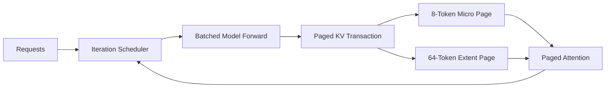

# kim-kvcache

基于 C++/CUDA 的单 GPU LLM 推理运行时，以异构 Paged KV Cache 为核心，支持
TinyLlama 1.1B FP16、动态 Batched Forward、Chunked Prefill 和 Greedy Generation。



## 核心能力

### 异构 Paged KV Cache

`src/runtime`、`src/cuda/kv`

- 8-Token Micro Page + 64-Token Extent Page
- Prefix Fork、Partial-Tail COW、Promotion、Page Lease
- Fixed-8/16/32/64 对照实现
- Token 级事务：全部 Decoder Layer 成功后提交，失败自动回滚

### CUDA Model Runner

`src/cuda/model`、`src/cuda/attention`

- TinyLlama FP16 Decoder、LM Head、Greedy Argmax
- cuBLAS GEMM，Dense 算子支持动态 `batch_size`
- Paged Decode Attention、GQA、预分配 Workspace
- Manifest 校验 Shape、Offset 和逐 Tensor SHA-256

### Iteration Scheduler

`src/engine`

- FIFO 动态组批，支持请求加入、退出、取消和失败隔离
- c1/c2/c4 Batched Forward，默认最大 Batch Size 为 8
- Chunked Prefill 与 Decode 混合调度
- 活跃请求、Batch Token 和 KV Token 三类预算
- 输出 TTFT、TPOT、E2E 和 Batch 利用率

## 验证

环境：RTX 3060 12 GiB、CUDA 12.6.85、TinyLlama 1.1B Chat FP16。

| 项目 | 结果 |
|---|---|
| CPU / CUDA Release | `13/13 PASS` / `20/20 PASS` |
| CPU ASan/UBSan | `12/12 PASS` |
| CUDA Sanitizer | memcheck、racecheck、initcheck：`0 errors` |
| 模型正确性 | Hidden、Logits、Top-10 通过数值门禁 |
| 端到端生成 | 8 个 Prompt 的完整 Token 与 Transformers FP16 一致 |
| Batch | c2/c4 平均 Batch Size 分别为 `2` / `4` |
| KV 收益 | Long Gather `-65.03%`；相对 Fixed-64 碎片 `-88.69%～-91.63%` |

测试与性能结果位于 `tests/reference` 和 `benchmarks/results`。

## 构建

```bash
# CPU
cmake --preset cpu-release
cmake --build --preset cpu-release --parallel
ctest --preset cpu-release

# CUDA
CUDACXX=/path/to/nvcc cmake --preset cuda-release
cmake --build --preset cuda-release --parallel
ctest --preset cuda-release
```

## 运行

先使用 `scripts/convert_tinyllama_weights.py` 转换权重：

```bash
build-k5-cuda-release/tools/kim_kv_tinyllama_generate \
  --manifest /path/to/model.manifest \
  --weights /path/to/model.weights \
  --tokens 1,450,7483,310,3444,338 \
  --max-new-tokens 32 \
  --output /tmp/generation.json
```

完整 KV 与端到端矩阵分别运行：

```bash
scripts/run_k6_release_matrix.sh
scripts/run_e5_end_to_end.sh
```

## 当前边界

- 单 GPU、单模型、同步 Scheduler
- Paged Attention 仍按 Batch Lane 提交
- Chunk 内同一请求按因果 Wave 推进，尚无融合的多 Token Prefill Attention

## TODO

- 在 Generation 路径自动触发 Micro → Extent Promotion
- 实现融合的 Batched Paged Attention Kernel
- 实现真正的多 Token Chunked Prefill 与因果 Attention
- 支持异步、多 Stream 调度
- 接入 `kim-llm-serving` MiniEngine Backend
