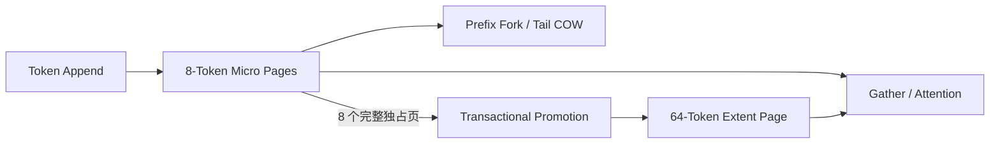

# 基于 C++/CUDA 的异构分页 KV Cache

`kim-kvcache` 是一个面向 LLM 推理服务的双粒度 Paged KV Cache。项目使用 8-Token Micro Page 承载活跃尾部和分叉位置，将稳定历史合并为64-Token Extent Page，以降低尾部碎片和长序列的页面访问开销。

项目独立于 TensorRT-LLM，重点验证页面所有权、事务式 Promotion、前缀共享、
CUDA 生命周期和性能权衡。



## 特性

### 1. 8/64 双粒度页面

模块见 `src/core` 和 `src/runtime`。项目使用独立的 Micro/Extent Page Pool，
`PageHandle` 通过 `kind + slot + generation` 防止槽位复用后的旧引用访问。
Block Table 维护连续的逻辑 Token 映射，支持 Append、Seal 和按 Token 查询。

### 2. 事务式页面晋升

模块见 `src/runtime/promotion.cpp` 和 `src/cuda/cuda_kv_promotion.cpp`。
连续 8 个完整、已封存且独占的 Micro Page 可以通过
`Prepare -> CUDA Copy -> Commit/Rollback` 合并为一个 Extent Page。
OOM、映射冲突或 CUDA Copy 失败时均回滚，不暴露半完成映射。

### 3. 前缀共享与 CUDA 生命周期

模块见 `src/runtime/kv_cache_lifecycle.cpp`、`src/runtime/page_lease.cpp` 和
`src/cuda/cuda_kv_cache.cpp`。请求可以共享只读前缀，Partial Tail 在继续写入时执行
Copy-on-Write。Page Lease 保证异步 CUDA 工作完成前页面槽位不会被释放和复用。

### 4. 可执行固定页对照

模块见 `src/fixed` 和 `src/cuda/fixed_cuda_kv_cache.cpp`。项目提供
Fixed-8/16/32/64 CPU 与 CUDA 运行时，并与 Hetero-8/64 使用相同 Workload、
数据布局和 CUDA Event 计时边界。

### 5. Engine-facing 逐层 KV 事务

模块见 `src/engine`、`src/runtime/token_reservation.cpp`、
`src/fixed/fixed_token_reservation.cpp` 和 `src/cuda/cuda_engine_*`。Heterogeneous
与 Fixed 后端共同实现 `EngineKvBackend`，以不可见的单 Token Metadata
Reservation 强制逐层 `Write -> Attend`，并在 Token 边界统一 Commit 或 Rollback。

直接 Paged Decode Attention 按 Device Block Descriptor 遍历 Micro/Extent Page，
支持 GQA 和预分配 Workspace；Descriptor 每次 Reserve 只上传一次，逐层调用不执行
Host Wait，也不分配临时 Attention Buffer。

### 6. TinyLlama FP16 单请求 ModelRunner

模块见 `src/model`、`src/cuda/cuda_model_*` 和 `tools/tinyllama_validate.cpp`。
离线转换工具将固定 revision 的 TinyLlama BF16 Safetensors 转换为 FP16 二进制和
带逐 Tensor SHA-256 的版本化 Manifest；C++ Loader 严格校验模型配置、Tensor 集合、
Shape、Offset、长度和校验和。

ModelRunner 复用 cuBLAS GEMM，并实现 Embedding、RMSNorm、RoPE、Residual、SwiGLU、
Final RMSNorm、LM Head 和 Greedy Argmax。模型 Workspace 在初始化时一次分配；逐 Token、
逐 Layer 稳定路径不执行 `cudaMalloc/cudaFree`。每层 Q/K/V 真实进入 Engine KV Transaction
和直接 Paged Decode Attention，最终 Logits 与 Argmax 成功后才提交该 Token。

## 验证结果

测试环境为 RTX 3060 12 GiB、TinyLlama 1.1B FP16 和 CUDA 12.6.85。

| 验证项 | 结果 |
|---|---|
| CPU Release 契约测试 | `11/11 PASS` |
| CUDA Release 契约测试 | `18/18 PASS` |
| CPU ASan/UBSan | `9/9 PASS` |
| Engine CUDA Sanitizer | memcheck、racecheck、initcheck 全绿 |
| K6 正式矩阵 | 30 份 CPU + 30 份 CUDA 报告全部成功，193 项 SHA-256 通过 |
| 容量模型 | 相比 Fixed-64，碎片降低 `88.69%～91.63%`，12 GiB 下 Admission 提升 `6.52%～21.21%` |
| Long Gather（Nsight Compute） | Hetero `278.590 µs`，Fixed-8 `796.740 µs`，降低 `65.03%` |
| Promotion 盈亏平衡 | Long 和 Mixed 相对 Fixed-8 均为约 `2` 次后续访问 |
| TinyLlama FP16 Reference | 首/中/末层与 Final Hidden 均在 `0.05` 绝对误差内；Logits 最大/平均绝对误差 `0.01951/0.00347`；Top-10 `10/10`、逐位置 Greedy Token 全一致 |

完整 Release 结果位于
`benchmarks/results/f593161df222_20260829T084127Z_k6`，Nsight Compute 结果位于
`benchmarks/results/701205929a9b_20260829T103733Z_k6_profile`。

上述 K6/Nsight 性能结果仍是独立 Metadata/CUDA Data Path Benchmark，不代表端到端
模型 Serving 加速。E2 ModelRunner 已形成真实单请求、预 Token 化输入的模型前向闭环；Generation Loop、
EOS/长度终止、并发 Scheduler 和端到端 Serving 指标仍属于后续阶段。

## 构建与测试

CPU-only 构建不依赖 CUDA：

```bash
cmake --preset cpu-release
cmake --build --preset cpu-release --parallel
ctest --preset cpu-release
```

CUDA Release 默认面向 RTX 3060（SM 86）：

```bash
CUDACXX=/path/to/cuda/bin/nvcc cmake --preset cuda-release
cmake --build --preset cuda-release --parallel
ctest --preset cuda-release
```

`nvcc` 已在 `PATH` 中时可以省略 `CUDACXX`。

## TinyLlama E2 数值验证

使用包含 PyTorch、Transformers 和 Safetensors 的 Python 环境离线转换权重：

```bash
python scripts/convert_tinyllama_weights.py \
  --model-dir /path/to/TinyLlama-1.1B-Chat-v1.0 \
  --output-dir /path/to/converted-model
```

运行 C++ 单请求 ModelRunner，并与 Transformers FP16 Eager Reference 对照：

```bash
build-k5-cuda-release/tools/kim_kv_tinyllama_validate \
  --manifest /path/to/converted-model/tinyllama-1.1b-chat-fp16.manifest \
  --weights /path/to/converted-model/tinyllama-1.1b-chat-fp16.weights \
  --tokens 1,450,7483,310,3444,338 \
  --output /tmp/tinyllama-runtime.json

python scripts/validate_tinyllama_reference.py \
  --model-dir /path/to/TinyLlama-1.1B-Chat-v1.0 \
  --runtime-json /tmp/tinyllama-runtime.json \
  --output /tmp/tinyllama-reference-report.json
```

已复现的机器可读摘要位于
`tests/reference/tinyllama_e2_reference_report.json`。

## Benchmark

正式 Hetero/Fixed CPU 与 CUDA 矩阵：

```bash
KIM_KV_CUDA_ROOT=/path/to/cuda ./scripts/run_k6_release_matrix.sh
```

单独运行 Fixed-8 CUDA Long Workload：

```bash
build-k5-cuda-release/benchmarks/kim_kv_cuda_benchmark \
  --workload long \
  --fixed-page-tokens 8 \
  --output-dir /tmp/kim-kv-fixed-8
```

将 `8` 替换为 `16`、`32` 或 `64` 可运行其他固定页对照；省略
`--fixed-page-tokens` 则运行 Hetero-8/64。

## 当前范围

当前版本实现

- 独立 CPU/CUDA Reference Path
- 活跃前缀共享
- Partial-Tail COW
- 事务式 Promotion
- 可复现 Benchmark
- Engine-facing KV 接口与 move-only Token Transaction 契约
- 单 Token Metadata Reserve/Commit/Rollback 与同 Request 冲突隔离
- Heterogeneous/Fixed 逐层 CUDA KV Write 和直接 Paged Decode Attention
- GQA、Micro/Extent 混合页与预分配 Attention Workspace
- 固定 TinyLlama 1.1B Chat Revision 的 FP16 Manifest/Weight Loader
- 单请求 ModelRunner、完整 Decoder Layer、LM Head 和 Greedy Argmax
- 首/中/末层 Hidden、Final Hidden、Logits、Top-K 和逐位置 Token 数值门禁

## TODO

- Generation Loop 与 Iteration Scheduler
- Fixed/Heterogeneous 端到端正确性和性能对照
- Nsight Systems GPU Timeline 仍待在兼容环境补采
