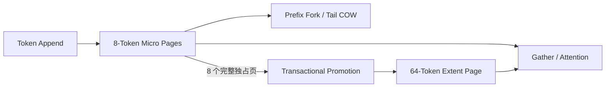

# 基于 C++/CUDA 的异构分页 KV Cache

`kim-kvcache` 是一个面向 LLM 推理服务的双粒度 Paged KV Cache。项目使用 8-Token Micro Page 承载活跃尾部和分叉位置，将稳定历史合并为64-Token Extent Page，以降低尾部碎片和长序列的页面访问开销。

项目独立于 TensorRT-LLM，重点验证页面所有权、事务式 Promotion、前缀共享、
CUDA 生命周期和性能权衡。



## 特性

### 1. 8/64 双粒度页面

模块见 `src/core` 和 `src/runtime`。项目使用独立的 Micro/Extent Page Pool，
`PageHandle` 通过 `kind + slot + generation` 防止槽位复用后的旧引用访问。
Block Table 维护连续的逻辑 Token 映射，支持 Append、Seal 和按 Token 查询。

### 2. 事务式页面晋升

模块见 `src/runtime/promotion.cpp` 和 `src/cuda/cuda_kv_promotion.cpp`。
连续 8 个完整、已封存且独占的 Micro Page 可以通过
`Prepare -> CUDA Copy -> Commit/Rollback` 合并为一个 Extent Page。
OOM、映射冲突或 CUDA Copy 失败时均回滚，不暴露半完成映射。

### 3. 前缀共享与 CUDA 生命周期

模块见 `src/runtime/kv_cache_lifecycle.cpp`、`src/runtime/page_lease.cpp` 和
`src/cuda/cuda_kv_cache.cpp`。请求可以共享只读前缀，Partial Tail 在继续写入时执行
Copy-on-Write。Page Lease 保证异步 CUDA 工作完成前页面槽位不会被释放和复用。

### 4. 可执行固定页对照

模块见 `src/fixed` 和 `src/cuda/fixed_cuda_kv_cache.cpp`。项目提供
Fixed-8/16/32/64 CPU 与 CUDA 运行时，并与 Hetero-8/64 使用相同 Workload、
数据布局和 CUDA Event 计时边界。

## 验证结果

测试环境为 RTX 3060 12 GiB、TinyLlama 1.1B FP16 和 CUDA 12.6.85。

| 验证项 | 结果 |
|---|---|
| CPU Release 契约测试 | `8/8 PASS` |
| CUDA Release 契约测试 | `13/13 PASS` |
| K6 正式矩阵 | 30 份 CPU + 30 份 CUDA 报告全部成功，193 项 SHA-256 通过 |
| 容量模型 | 相比 Fixed-64，碎片降低 `88.69%～91.63%`，12 GiB 下 Admission 提升 `6.52%～21.21%` |
| Long Gather（Nsight Compute） | Hetero `278.590 µs`，Fixed-8 `796.740 µs`，降低 `65.03%` |
| Promotion 盈亏平衡 | Long 和 Mixed 相对 Fixed-8 均为约 `2` 次后续访问 |

完整 Release 结果位于
`benchmarks/results/f593161df222_20260829T084127Z_k6`，Nsight Compute 结果位于
`benchmarks/results/701205929a9b_20260829T103733Z_k6_profile`。

当前仅为独立 Metadata/CUDA Data Path Benchmark，不代表端到端模型 Serving 加速。

## 构建与测试

CPU-only 构建不依赖 CUDA：

```bash
cmake --preset cpu-release
cmake --build --preset cpu-release --parallel
ctest --preset cpu-release
```

CUDA Release 默认面向 RTX 3060（SM 86）：

```bash
CUDACXX=/path/to/cuda/bin/nvcc cmake --preset cuda-release
cmake --build --preset cuda-release --parallel
ctest --preset cuda-release
```

`nvcc` 已在 `PATH` 中时可以省略 `CUDACXX`。

## Benchmark

正式 Hetero/Fixed CPU 与 CUDA 矩阵：

```bash
KIM_KV_CUDA_ROOT=/path/to/cuda ./scripts/run_k6_release_matrix.sh
```

单独运行 Fixed-8 CUDA Long Workload：

```bash
build-k5-cuda-release/benchmarks/kim_kv_cuda_benchmark \
  --workload long \
  --fixed-page-tokens 8 \
  --output-dir /tmp/kim-kv-fixed-8
```

将 `8` 替换为 `16`、`32` 或 `64` 可运行其他固定页对照；省略
`--fixed-page-tokens` 则运行 Hetero-8/64。

## 当前范围

当前版本实现
- 独立 CPU/CUDA Reference Path
- 活跃前缀共享
- Partial-Tail COW
- 事务式 Promotion 
- 可复现 Benchmark

## TODO
- 持久 Prefix Cache、缓存淘汰
- TensorRT-LLM 集成和端到端 Serving 指标
- Nsight Systems GPU Timeline 仍待在兼容环境补采
