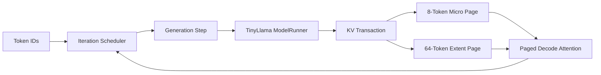

# kim-kvcache

基于 C++/CUDA 的最小 LLM 推理运行时。项目以异构 Paged KV Cache 为核心，完成
TinyLlama 1.1B FP16 的逐 Token 前向、Greedy Generation、Iteration Scheduler 和
资源生命周期管理。



## 特性

### 1. 异构 Paged KV Cache

使用 8-Token Micro Page 保存活跃尾部和分叉位置，将稳定历史事务式合并为
64-Token Extent Page。支持前缀共享、Partial-Tail COW、Page Lease 和
Fixed-8/16/32/64 对照实现。

### 2. Engine KV 与模型执行

`EngineKvBackend` 和 move-only `TokenTransaction` 强制每层
`Write -> Attend`，全部层成功后才提交 Token，失败时回滚。Paged Decode Attention
直接读取 Micro/Extent Page，支持 GQA，并复用预分配 Workspace。

TinyLlama ModelRunner 使用 FP16 权重、cuBLAS GEMM 和 CUDA 算子实现完整 Decoder、
LM Head 与 Greedy Argmax。权重 Manifest 记录 Shape、Offset 和逐 Tensor SHA-256。

### 3. Generation Loop 与 Iteration Scheduler

支持预 Token 化输入、`max_new_tokens`、EOS、取消和 Runtime Stop，完成
`Prefill -> Decode -> Terminal`。每个请求返回唯一终态、Usage、TTFT、TPOT 和 E2E，
退出后统一回收 KV 资源。

`IterationSchedulerRuntime` 使用 FIFO 轮转在 Token 边界动态加入和退出请求，支持
`c1/c2/c4`、请求取消、跨请求失败隔离、Stop 排空，以及活动请求、每轮 Token 和 KV
Token 三类预算。第一版在共享 ModelRunner/Stream 上逐请求推进，不宣称融合 Batch Kernel。

## 验证结果

测试环境：RTX 3060 12 GiB、CUDA 12.6.85、TinyLlama 1.1B Chat FP16。

| 验证项 | 结果 |
|---|---|
| CPU / CUDA Release | `13/13 PASS` / `20/20 PASS` |
| CPU ASan/UBSan | `12/12 PASS` |
| CUDA Sanitizer | memcheck、racecheck、initcheck 均为 `0 errors` |
| TinyLlama 数值 | Hidden/Logits 通过误差门禁，Top-10 `10/10` |
| Generation | ISL32/128、OSL32 Token 与 Transformers FP16 全一致 |
| Scheduler | CUDA 小模型 c1/c2/c4 Token 与独立 FP16 Reference 全一致 |
| 资源稳定性 | 真实模型连续 100 次结果一致，KV 归零，GPU 空闲显存差值 `0` |
| Long Gather | Hetero 相比 Fixed-8 降低 `65.03%` |
| 容量模型 | 相比 Fixed-64，碎片降低 `88.69%～91.63%` |

结果位于 `tests/reference` 和 `benchmarks/results`。Benchmark 数据是独立 KV Data Path
结果，不代表端到端模型 Serving 加速。

## 构建与测试

```bash
# CPU
cmake --preset cpu-release
cmake --build --preset cpu-release --parallel
ctest --preset cpu-release

# CUDA
CUDACXX=/path/to/cuda/bin/nvcc cmake --preset cuda-release
cmake --build --preset cuda-release --parallel
ctest --preset cuda-release
```

## TinyLlama Generation

权重可通过 `scripts/convert_tinyllama_weights.py` 从 Hugging Face 模型离线转换。

```bash
build-k5-cuda-release/tools/kim_kv_tinyllama_generate \
  --manifest /path/to/model.manifest \
  --weights /path/to/model.weights \
  --tokens 1,450,7483,310,3444,338 \
  --max-new-tokens 32 \
  --output /tmp/generation.json

python scripts/validate_tinyllama_generation.py \
  --manifest /path/to/model.manifest \
  --weights /path/to/model.weights \
  --runtime-json /tmp/generation.json \
  --output /tmp/reference.json
```

KV Benchmark 可通过 `scripts/run_k6_release_matrix.sh` 运行。

## 当前范围

当前实现为单 GPU、单模型、同步 Iteration Scheduler；每轮在共享 Stream 上串行推进
最多 `max_batched_tokens` 个请求。尚未实现融合/并行 Batch Model Forward。

## TODO
- Fixed/Heterogeneous 端到端模型对照；
- 正式 TTFT、TPOT 和吞吐 Benchmark。
